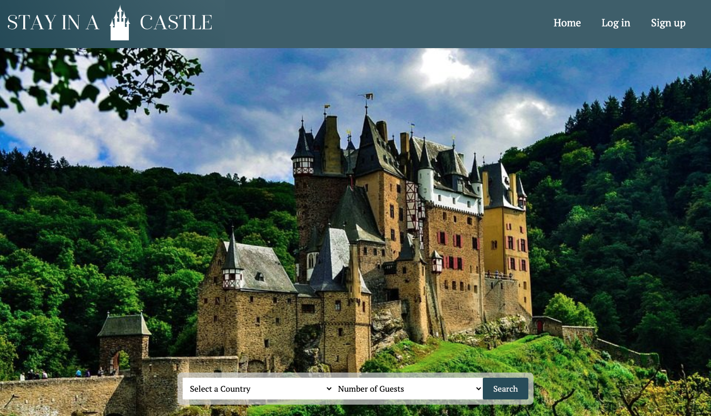

# Stay in a Castle

Stay in a Castle was a full-stack project built by myself and one other team-mate for the Ironhack bootcamp. Users are able to sign-up and login to view and save different Castle Hotels around Europe. 

## Demo

View the live demo: https://stayinacastle.herokuapp.com/

### Features

* Search Europe by Country for Castle Hotels
* View individual Castle profile pages with Google Map
* Logni as a User or Admin
* Users are able to 
    * Add favorites to profile
    * Connect to Castle Hotel's booking sites
* Admins are able to:
    * Create, Edit, Delete Castle profiles

### Usage

This app uses Javasctipt, Node.js, MongoAtlas, Bootstrap, Heroku and GoogleMapsAPI